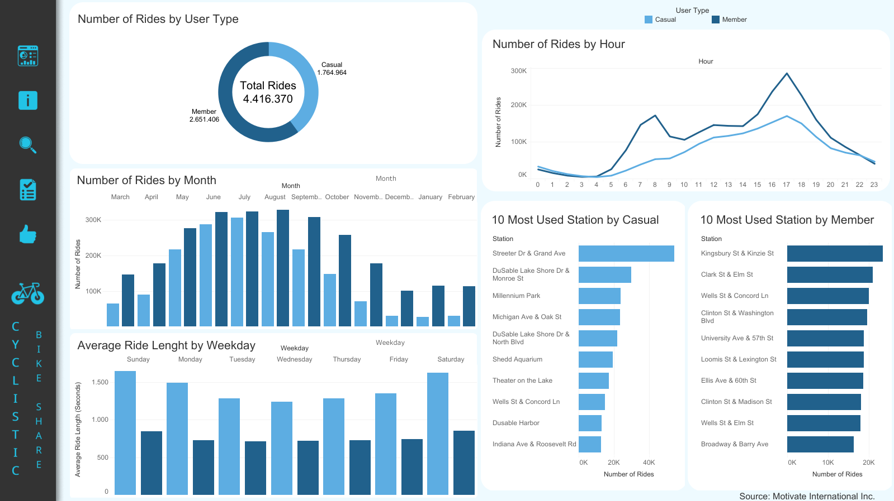

# Google Data Analytics Capstone | Cyclistic Bike-Share

 

# Project Description

 

In this project, I will perform a case study available by [Projeto Final de Data Analytics do Google](https://www.coursera.org/learn/projeto-final-conclua-um-estudo-de-caso?specialization=analise-de-dados-do-google). In the project, I will be part of a marketing analyst team at Cyclistic, a fictional bike-share company in Chicago. The team will be responsible for understanding how casual riders and annual members use Cyclistic bikes differently. So, I will follow the steps of the data analysis process:<strong> ask, prepare, process, analyze, share, and act</strong>, to gain insights to answer the business task.

 

## Scenario

 

You are a junior data analyst working in the marketing analyst team at Cyclistic, a bike-share company in Chicago. The director of marketing believes the company's success depends on maximizing the number of annual memberships. Therefore, your team wants to understand how casual riders and annual members use Cyclistic bikes differently. From these insights, your team will design a new marketing strategy to convert casual riders into annual members. But first, Cyclistic executives must approve your recommendations, so they must be backed up with compelling data insights and professional data visualizations.

 

## Understanding the context

 

Cyclistic: A bike-share program that features more than 5.800 bicycles and 600 docking stations. Cyclistic sets itself apart by also offering reclining bikes, hand tricycles, and cargo bikes, making bike-share more inclusive to people with disabilities and riders who can't use a standard two-wheeled bike. The majority of riders opt for traditional bikes; about 8% of riders use the assistive options. Cyclistic users are more likely to ride for leisure, but about 30% use them to commute to work each day.

In 2016, Cyclistic launched a successful bike-share offering. Since then, the program has grown to a fleet of 5,824 geo-tracked and locked bikes within a network of 692 stations in Chicago. The bikes can be unlocked from one station and returned to any other station in the system at any time.

Until now, Cyclistic's marketing strategy relied on building general awareness and appealing to broad consumer segments. One approach that helped make these things possible was the flexibility of its pricing plans; single-ride passes, full-day passes, and annual memberships. Customers that purchase single-ride or full-day passes refer to casual riders. Customers that purchase annual memberships are Cyclistic members.

Cyclistic's finance analysts have concluded that annual members are much more profitable than casual passengers. Although the pricing flexibility helps Cyclistic attract customers, Lily Moreno believes that maximizing the number of annual members will be the key to future growth. Rather than creating a marketing campaign that targets new customers, she believes there is a good chance to convert casual passengers into members. She notes that casual cyclists are already aware of the Cyclistic program and have chosen Cyclistic for their mobility needs.

Moreno has set a clear goal: Design marketing strategies aimed at converting casual riders into annual members. In order to
do that, however, the marketing analyst team needs to better understand how annual members and casual riders differ, why
casual riders would buy a membership, and how digital media could affect their marketing tactics. Moreno and her team are
interested in analyzing the Cyclistic historical bike trip data to identify trends.

 

## Stakeholders

 

Lily Moreno: The director of marketing and your manager. Moreno is responsible for the development of campaigns and initiatives to promote the bike-share program. These may include email, social media, and other channels.

Cyclistic marketing analytics team:A team of data analysts who are responsible for collecting, analyzing, and reporting data that helps guide Cyclistic marketing strategy. You joined this team six months ago and have been busy learning about Cyclistic's mission and business goals - as well as how you, as a junior data analyst, can help Cyclistic achieve them.

Cyclistic executive team: The notoriously detail-oriented executive team will decide whether to approve the recommended marketing program.

 

## Questions

 

Three questions will guide the future marketing program:

1. How do annual members and casual riders use Cyclistic bikes differently?
2. Why should casual riders buy Cyclistic annual membership?
3. How can Cyclistic use digital media to influence casual riders to become members?

Moreno has assigned you the first question to answer: How do annual members and casual riders use Cyclistic bikes differently?

 

With the business task defined, I will create a report with the following deliverables:

  1. A clear statement of the business task
  2. A description of all data sources used
  3. Documentation of any cleaning or manipulation of data
  4. A summary of your analysis
  5. Supporting visualizations and key findings
  6. Your top three recommendations based on your analysis

 

You can find the report in this repository! [Click here]()

 
 

# Datasets

 

The datasets used in this analysis contain historical trip data on Cyclistic (bike sharing service) for the past 12 months, from March 2022 to February 2023, all located in Chicago. In total, there are 12 datasets, each one representing a specific month with 13 columns. All the data has been made available by Motivate International Inc. by this [license](https://ride.divvybikes.com/data-license-agreement). The data are available through this [link](https://divvy-tripdata.s3.amazonaws.com/index.html).  

 
 

# Tools used

 

In this analysis, I will use the RStudio integrated development environment (IDE) (2023.03.0 Build 386)
and the programming language R (Version 4.2.2), which is a tool with the ability to work in all data analysis process stages, as well as being a tool that allows work with large amounts of data.

I will also use Tableau, a powerful data visualization and business intelligence tool that helps people see and understand data through beautiful and intuitive dashboards.

 
 

# Dashboard

 

The dashboard is in the following [link](https://public.tableau.com/app/profile/tauan.oliveira/viz/GoogleCapstone_Cyclistic/Dashboard)

 
 

# Slide Presentation

 

You can find the slide presentation in this repository, or if you prefer, in the following [link](https://docs.google.com/presentation/d/1Xle5LL3M5HYpeVHckAZl9gSboXSB8qSKlNrfsPda5ps/edit#slide=id.gc6f9e470d_0_0)

 
 

# Author

👤 Tauan Oliveira

  * Kaggle: https://www.kaggle.com/tauanoliveira
  * Tableau: https://public.tableau.com/app/profile/tauan.oliveira
  * Github: https://github.com/TndOliveira
  